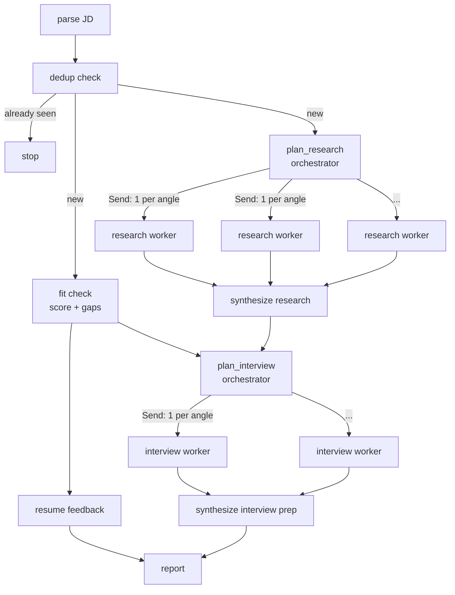

# Job Application Agent

Takes a job description and a resume, and produces a fit assessment, resume
feedback, company research, and interview prep.

## How it works



## The process

1. **Parse** - turn the raw job description text into structured fields (company,
   title, requirements, ...).
2. **Dedup** - has this company + title already been processed? If so, stop. Plain
   fuzzy-matching, no LLM involved.
3. **Fit check** - a 0-100 fit score plus an itemized gap list (requirement,
   severity, evidence in the resume), shown at the top of the report. Informational
   only - it doesn't skip anything downstream. Deliberately doesn't try to also
   classify each gap as "fixable by rewriting" vs "structural" - that judgment
   turned out to be the least reliable thing in the pipeline (categorical flips
   across identical repeated calls, even at temperature 0) and duplicates what
   resume_feedback determines anyway, per gap, after actually attempting a reframe.
4. **Resume feedback** - always runs. For every gap `fit_check` listed, addressed
   exactly, none invented or skipped - an honest attempt to reframe existing resume
   content to close it, including saying so when a reframe doesn't actually close the
   gap. (An earlier version also gave generic "resume polish" tips - ATS keyword
   alignment, bullet reordering - but that's not what anyone reading the report
   wanted, so it was cut rather than left in unread.)
5. **Company research, as an actual orchestrator-workers pattern:**
   - `plan_research` (the orchestrator) decides, per company, which specific angles
     are worth investigating - 1 to 4, varying with the input rather than a fixed
     template. A public company and an obscure startup get different plans.
   - Each planned angle is delegated to a `research_worker` instance running in
     parallel (via LangGraph's `Send`, so the fan-out width matches however many
     angles were planned, not a hardcoded count). Each worker searches
     ([Tavily](https://tavily.com)) and synthesizes its one angle independently -
     one failing doesn't take the others down.
   - `synthesize_research` merges all the workers' findings into short, scannable
     key points - not a narrative paragraph, which is what this used to produce
     until it turned into a wall of text nobody read in full.
6. **Interview prep, a second and independent orchestrator-workers pattern:**
   - `plan_interview` (the orchestrator) waits on both `fit_check` (gap context) and
     `synthesize_research` (company context), then decides which angles are worth a
     dedicated question round - 1 to 6, more for candidates with more substantive
     gaps or companies with richer research, not a fixed template. Each angle gets a
     category from a fixed set (`gap_probe`, `company_fit`, `behavioral`,
     `technical_depth`, `closing`) assigned once, here.
   - Each angle fans out to an `interview_worker` instance (via `Send`) that writes
     exactly one question for its angle - deliberately not "1-3": letting a single
     worker write up to 3 meant angle count and questions-per-angle multiplied
     together, and that ceiling (up to 6 angles x 3 questions = 18) was routinely
     hit with near-duplicate coverage of the same gap. One question per angle keeps
     the total tied to the angle count, which is already input-driven and bounded.
     The category on every question is the angle's own category, not re-invented per
     question - that's what keeps categorization consistent across a run, unlike
     free-text categories chosen per-question, which were measured to vary in wording
     on every single trial even on identical input.
   - `synthesize_interview_prep` merges all the workers' questions and adds one
     overall prep-notes summary on top.
7. **Compile report** - merges resume feedback and interview prep into one document.

## Running it

```bash
cp .env.example .env   # fill in your LLM + Tavily keys
.venv/bin/python -m jobagent.cli --jd examples/jd_sample.txt --resume examples/resume_sample.md
```

Tests: `.venv/bin/pytest`. Judgment-quality eval: see `eval/run_eval.py`.
